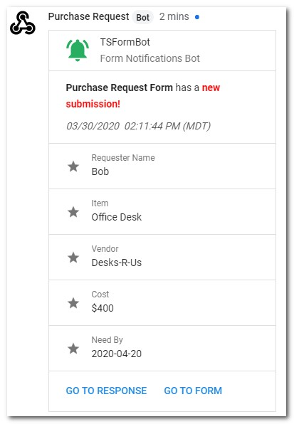

## TSFormBot

**TSFormBot** is an [Apps Script](https://www.google.com/script/start/) powered [Google Form](https://www.google.com/forms/about/) **Hangouts Chat Bot** which creates form submission webhook notifications for [Hangouts Chat Rooms](https://gsuite.google.com/products/chat/).

*See original [blog post](https://medium.com/@techstreams/tsformbot-a-google-form-hangouts-chat-bot-powered-by-google-apps-script-101a3b3d8773).*

TSFormBot has been upgraded to include form responses.

| SUPPORTED | GOOGLE FORM ELEMENT |
| :-------: | :----------------- |
| :heavy_check_mark: | Short Answer |
| :heavy_check_mark: | Paragraph |
| :heavy_check_mark: | Multiple Choice |
| :heavy_check_mark: | Checkboxes |
| :heavy_check_mark: | Dropdown |
| :heavy_check_mark: | Linear Scale |
| :heavy_check_mark: | Multiple Choice Grid |
| :heavy_check_mark: | Checkbox Grid |
| :heavy_check_mark: | Date |
| :heavy_check_mark: | Date/Time |
| :heavy_check_mark: | Time |
| :heavy_check_mark: | Duration |
| :x: | File Upload |

 

**Important:**

*:point_right: Forms with the ['collect respondents' email addresses'](https://support.google.com/docs/answer/139706) option enabled will display the form submitter email in the bot notification.*

*:point_right: Form responses for elements containing images will only display associated text in the bot notification.*

 

**Looking for the previous version of TSFormBot?**  See [v1](https://github.com/techstreams/TSFormBot/tree/v1).

---

## Getting Started

### Installation

**New Install**

* Create a new [Google Form](form.new)
* From within the new form, select the **More _(three dots)_ > Script editor** menu 
* Delete the code in `Code.gs` from the script editor
* Click on the `Untitled project` project name, and rename to `TSFormBot`
* Copy and paste the [code](Code.gs) into the script editor
* Select the menu **File > Save all**
* Close the Script editor window
* Reload the Form

 

**Upgrade an Existing TSFormBot**

* Open existing TSFormBot enabled Google Form
* From within the form, select the **More _(three dots)_ > Script editor** menu 
* Delete the code in `Code.gs` from the script editor
* Copy and paste the [code](Code.gs) into the script editor
* Select the menu **File > Save all**
* Select the **Run > Enable new Apps Script runtime powered by V8** *(if V8 is not already enabled)*
* Select the **Edit > Current Project's Triggers**
* Delete any existing project `From form - On form submit` triggers *(click the __More > Delete trigger__ menu to the right of each trigger to delete)*
* Close the Project Triggers window
* Close the Script editor window
* Reload the Form

 

> *:grey_question: Prefer to install the __TSFormBot - Kitchen Sink Demo__?*
> * *Login to [Google Drive](https://drive.google.com/)*
> * *Access the __[TSFormBot - Kitchen Sink Demo](https://techstreams.page.link/TSFormBotSinkDemo)__*
> * *Click the __Use Template__ button. This will copy the form to Google Drive.*

 

### Create Hangouts Chat Room Webhook

**Access the Hangouts Chat Room Webhooks**

* Go to [Hangouts Chat](https://chat.google.com)
* Select the desired **Hangouts Chat room** *(or create a new one)*
* Select the **dropdown** for the room
* Select **Configure webhooks**

 

**Add a Webhook**

* Select **+ ADD WEBHOOK**

 

**Enter a Webhook Name**

* Enter a **webhook name**
* *(Optional) Enter an Avatar URL*
* Click **Save**

**Important:**

*:point_right: Multiple TSFormBot enabled Google Forms can be used to provide notifications to a single [Google Hangouts Chat Room](https://gsuite.google.com/products/chat/).  Be sure to use descriptive webhook names to disguish multiple bots.*

 

**Make a Copy of the URL**

* Click the **Copy** button to make a copy of the webhook URL

 

### Configure TSFormBot

**Enable TSFormBot**

* Open the form and wait for the menu to fully load
* Select the **TSFormBot** menu
* Select the **Enable Bot** menu
* *Complete the Google authoriation prompts if enabling TSFormBot for the first time and then re-run the __Enable Bot__ menu.*

 

**Enter the Webhook URL**

* Enter the full **Webhook URL** copied in **Make a Copy of the URL** step above
* Click **Ok**
* Click **Ok** when configuration complete

 

### Submit to the Google Form

* Submit an entry to the form
* A new form submission notification post will be made to the Hangouts Chat room

**Important:**

*:point_right: If the notification timestamp does not accurately reflect the correct timezone, ensure the Apps Script timezone is configured appropriately. The Apps Script timezone can be changed by opening the Form’s Apps Script editor (__More menu _(three dots)_ > Script editor__) and altering the timezone under the Apps Script editor __File > Project properties__ menu.*

 

## Important Notes

* Multiple TSFormBot enabled Google Forms can be used to provide notifications to a single [Google Hangouts Chat Room](https://gsuite.google.com/products/chat/).

* Check the [Apps Script Dashboard](https://script.google.com) for execution errors if TSFormBot does not work as expected.

* TSFormBot may not be appropriate for all Google Forms.

---

## License

**TSFormBot License**

© Laura Taylor ([github.com/techstreams](https://github.com/techstreams)). Licensed under an MIT license.

Permission is hereby granted, free of charge, to any person obtaining a copy of this software and associated documentation files (the "Software"), to deal in the Software without restriction, including without limitation the rights to use, copy, modify, merge, publish, distribute, sublicense, and/or sell copies of the Software, and to permit persons to whom the Software is furnished to do so, subject to the following conditions:

The above copyright notice and this permission notice shall be included in all copies or substantial portions of the Software.

THE SOFTWARE IS PROVIDED "AS IS", WITHOUT WARRANTY OF ANY KIND, EXPRESS OR IMPLIED, INCLUDING BUT NOT LIMITED TO THE WARRANTIES OF MERCHANTABILITY, FITNESS FOR A PARTICULAR PURPOSE AND NONINFRINGEMENT. IN NO EVENT SHALL THE AUTHORS OR COPYRIGHT HOLDERS BE LIABLE FOR ANY CLAIM, DAMAGES OR OTHER LIABILITY, WHETHER IN AN ACTION OF CONTRACT, TORT OR OTHERWISE, ARISING FROM, OUT OF OR IN CONNECTION WITH THE SOFTWARE OR THE USE OR OTHER DEALINGS IN THE SOFTWARE.
