## Overview

**TSFormBot** is a [Google Form](https://www.google.com/forms/about/) [Hangouts Chat Bot](https://gsuite.google.com/products/chat/) powered by [Google Apps Script](https://www.google.com/script/start/).

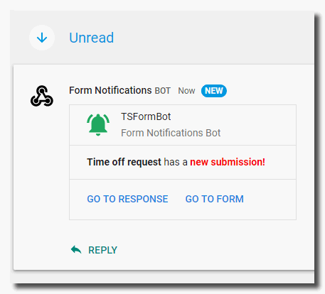

---

## How It Works

A submission to a **TSFormBot enabled Google Form** creates a notification in the associated [Google Hangouts Chat Room](https://gsuite.google.com/products/chat/).

---

## Getting Started

### 1) Install TSFormBot in Google Drive

* Login to [Google Drive](https://drive.google.com/)

* Access the **[TSFormBot enabled Time Off Requet form](https://docs.google.com/forms/d/1KWev-4-TlVLlNFPrCQlvawZXiDmGFEFJvm4PR2Hrycs/copy)**

* Click the ***Make a copy*** button. This will copy the form to Google Drive

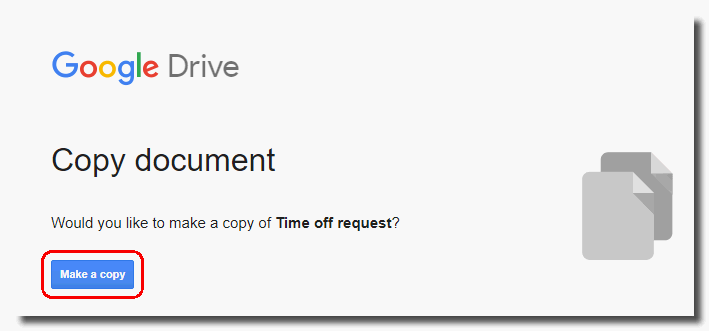

 

### 2) Access the Hangouts Chat Room Webhooks

* Go to [Hangouts Chat](https://chat.google.com)

* Select the desired **Hangouts Chat room** *(or create a new one)*

* Select the **dropdown** for the room

* Select **Configure webhooks**

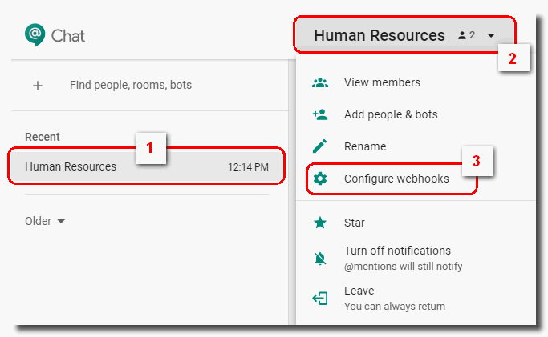

 

### 3) Add a Webhook

* Select **+ ADD WEBHOOK**

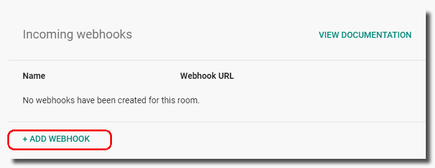

 

### 4) Enter a Webhook Name

* Enter a **webhook name**

* *(Optional) Enter an Avatar URL*

* Click **Save**

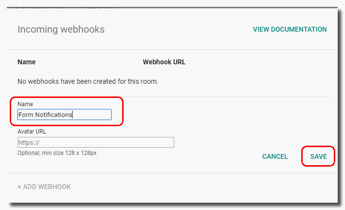

 

### 5) Make a Copy of the URL

* Click the **Copy** button to make a copy of the webhook URL for **Step 9**

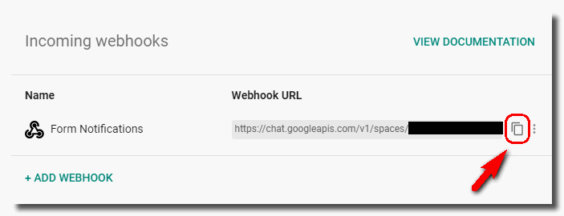

 

### 6) Open the newly copied "Time off Request" form and select the TSFormBot menu

* Select the **TSFormBot** menu

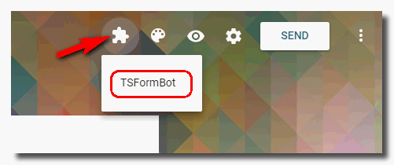

 

### 7) Enable the TSFormBot

* Select the **Enable Bot** menu

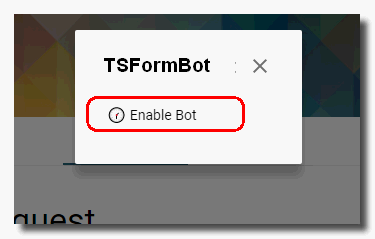

 

### 8) Authorize the bot

* Click **Continue**

* Select the account to authorize

* Review the permissions and click **Allow**

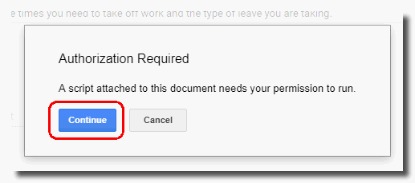

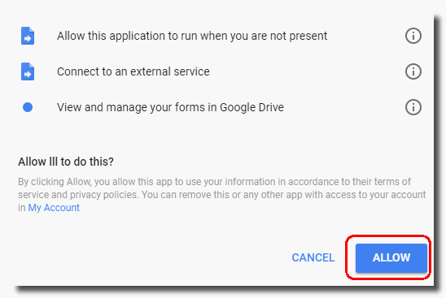

 

### 9) Enter the Webhook URL and Complete Configuration

* Enter the full **Webhook URL** copied in **Step 5**

* Click **Ok**

* Click **Ok** when configuration complete

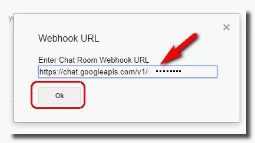

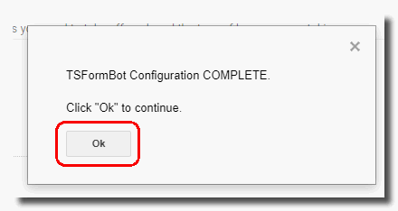

 

### 10) Submit to the Form

* Submit an entry to the form

* A new conversation post will be made to the Hangouts Chat room

* Click new conversation to see the post

* Access the **form** or **form response** using the conversion card buttons

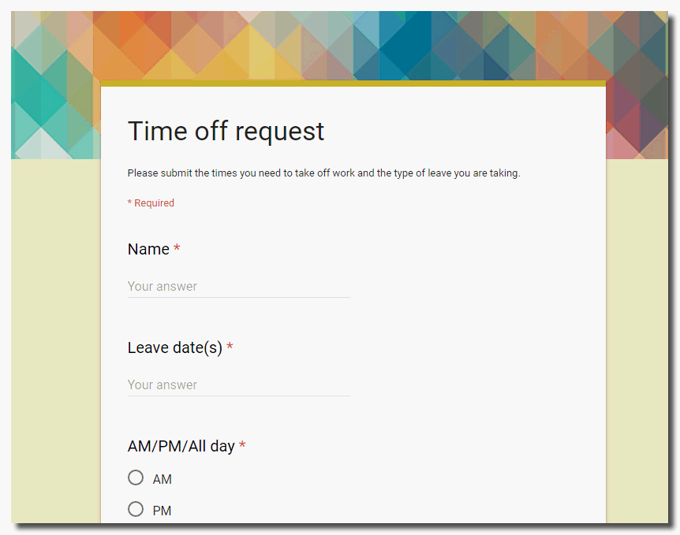

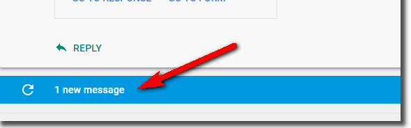

---

## License

**TSFormBot License**

© Laura Taylor ([github.com/techstreams](https://github.com/techstreams)). Licensed under an MIT license.

Permission is hereby granted, free of charge, to any person obtaining a copy of this software and associated documentation files (the "Software"), to deal in the Software without restriction, including without limitation the rights to use, copy, modify, merge, publish, distribute, sublicense, and/or sell copies of the Software, and to permit persons to whom the Software is furnished to do so, subject to the following conditions:

The above copyright notice and this permission notice shall be included in all copies or substantial portions of the Software.

THE SOFTWARE IS PROVIDED "AS IS", WITHOUT WARRANTY OF ANY KIND, EXPRESS OR IMPLIED, INCLUDING BUT NOT LIMITED TO THE WARRANTIES OF MERCHANTABILITY, FITNESS FOR A PARTICULAR PURPOSE AND NONINFRINGEMENT. IN NO EVENT SHALL THE AUTHORS OR COPYRIGHT HOLDERS BE LIABLE FOR ANY CLAIM, DAMAGES OR OTHER LIABILITY, WHETHER IN AN ACTION OF CONTRACT, TORT OR OTHERWISE, ARISING FROM, OUT OF OR IN CONNECTION WITH THE SOFTWARE OR THE USE OR OTHER DEALINGS IN THE SOFTWARE.

